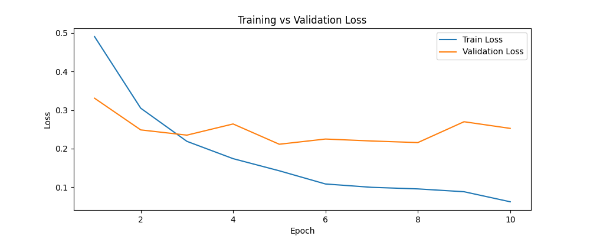
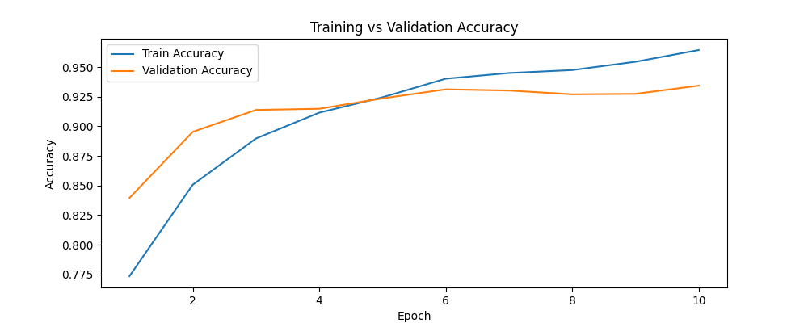
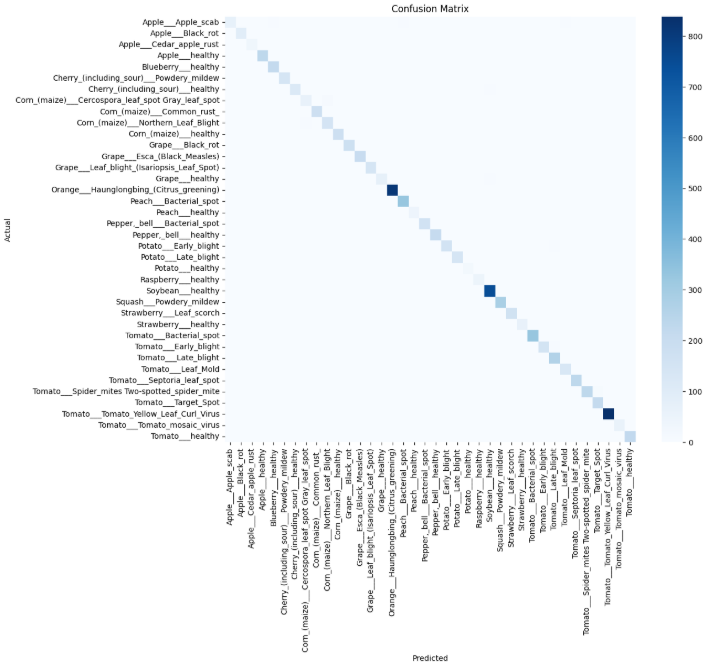

# 🌿 Plant Disease Classification using Convolutional Neural Networks


## 📌 Project Overview

This project implements a **deep learning pipeline for plant disease classification** using leaf images from the **PlantVillage dataset**. The goal is to automatically identify plant diseases from leaf images using a Convolutional Neural Network (CNN).

Early detection of plant diseases helps prevent large-scale agricultural losses and improves crop yield. The model learns visual patterns in plant leaves and predicts the corresponding disease class.

This project demonstrates a **complete machine learning workflow**, including:

* Data preprocessing and augmentation
* Class imbalance handling
* CNN architecture design
* GPU-accelerated training
* Model evaluation
* Performance visualization

The final trained model achieves **97.63% test accuracy** on unseen data.

## ✨ Project Highlights

• Built a CNN model from scratch for plant disease classification  
• Implemented weighted cross-entropy to handle class imbalance  
• Achieved **97.63% test accuracy** on the PlantVillage dataset  
• Trained on **54k images across 38 classes**  
• GPU-accelerated training using PyTorch  

## 🔑 Key Results

| Metric | Value |
|------|------|
| Test Accuracy | **97.63%** |
| Test Loss | **0.102** |
| Dataset Size | **54,305 Images** |
| Classes | **38 Plant Diseases** |
| Training Time | **~12.5 minutes (RTX 3060)** |

---

# 📊 Dataset

**Dataset:** PlantVillage
Source: [PlantVillage Dataset (Kaggle)](https://www.kaggle.com/datasets/abdallahalidev/plantvillage-dataset)

* **Total Images:** 54,305
* **Number of Classes:** 38 plant disease categories
* **Image Type:** RGB leaf images

### Example Classes

* Apple Scab
* Apple Black Rot
  
---

## 🖼 Image Processing

All images are transformed before training:

* Resize → **224 × 224**
* Random Horizontal Flip
* Random Rotation
* Conversion to Tensor
* Normalization

---

## 📂 Dataset Split

| Split      | Percentage |
| ---------- | ---------- |
| Training   | 70%        |
| Validation | 15%        |
| Test       | 15%        |

---

# ⚖️ Class Imbalance Handling

The dataset contains **class imbalance** where some classes contain significantly fewer samples.

Example:

| Class                | Samples |
| -------------------- | ------- |
| Potato Healthy       | 152     |
| Orange Huanglongbing | 5507    |

To mitigate this problem:

* **Weighted Cross Entropy Loss** was used
* Class weights were calculated using inverse frequency

---

# 🧠 Model Architecture

The model is implemented using **PyTorch**.

### CNN Architecture

```
Input: 224 × 224 × 3

Conv2D (3 → 32, kernel=3)
ReLU
MaxPool (2×2)

Conv2D (32 → 64, kernel=3)
ReLU
MaxPool (2×2)

Conv2D (64 → 128, kernel=3)
ReLU
MaxPool (2×2)

Flatten

Fully Connected (100352 → 512)
ReLU
Dropout (0.5)

Fully Connected (512 → 38)
```

### Architecture Summary

| Layer Type             | Count |
| ---------------------- | ----- |
| Convolution Layers     | 3     |
| Pooling Layers         | 3     |
| Fully Connected Layers | 2     |
| Dropout Layers         | 1     |

---

# ⚙️ Training Setup

### Hardware

* **GPU:** NVIDIA RTX 3060 (12GB)

### Framework

* **PyTorch**

### Hyperparameters

| Parameter     | Value                 |
| ------------- | --------------------- |
| Epochs        | 10                    |
| Batch Size    | 64                    |
| Optimizer     | Adam                  |
| Learning Rate | 0.001                 |
| Loss Function | Weighted CrossEntropy |
| Image Size    | 224 × 224             |

### Training Time

```
~12.5 minutes (10 epochs on RTX 3060)
```

---

# 📈 Training Results

| Epoch | Train Accuracy | Validation Accuracy |
| ----- | -------------- | ------------------- |
| 1     | 77.34%         | 83.95%              |
| 2     | 85.06%         | 89.53%              |
| 3     | 88.97%         | 91.38%              |
| 4     | 91.15%         | 91.48%              |
| 5     | 92.45%         | 92.36%              |
| 6     | 94.02%         | 93.12%              |
| 7     | 94.50%         | 93.02%              |
| 8     | 94.75%         | 92.70%              |
| 9     | 95.45%         | 92.74%              |
| 10    | **96.44%**     | **93.43%**          |

The validation accuracy stabilizes around **93–94%**, indicating strong generalization.

---

# 🧪 Final Model Performance

Evaluation on the **unseen test dataset**:

| Metric        | Value      |
| ------------- | ---------- |
| Test Accuracy | **97.63%** |
| Test Loss     | **0.102**  |

This indicates the model successfully learned disease-specific visual features.

---

# 📊 Training Visualizations

### Training vs Validation Loss



---

### Training vs Validation Accuracy



These curves demonstrate:

* steady reduction in training loss
* stable validation performance
* minimal overfitting

---

# 🔎 Confusion Matrix



The confusion matrix shows prediction performance across all 38 disease classes.
Most predictions lie on the diagonal, indicating strong classification accuracy.

---

# 📁 Repository Structure

```
plant-disease-classification
│
├── data/                # dataset (not included in repo)
│
├── results/
│   ├── Training_loss_curve.png
│   ├── Training_accuracy_curve.png
│   └── confusion_matrix.png
│
├── src/
│   ├── dataset.py
│   ├── model.py
│   ├── train.py
│   ├── evaluate.py
│   └── utils.py
│
├── requirements.txt
├── README.md
└── .gitignore
```

---

# ▶️ How to Run the Project

### 1️⃣ Install dependencies

```bash
pip install -r requirements.txt
```

### 2️⃣ Train the model

```bash
python src/train.py
```

### 3️⃣ Evaluate the model

```bash
python src/evaluate.py
```

---

# 📦 Dependencies

Main libraries used:

* PyTorch
* numpy
* matplotlib
* scikit-learn

Full dependency list is available in **requirements.txt**.

---

# 🚀 Future Improvements

Possible improvements include:

* Transfer learning using pretrained architectures
* Hyperparameter optimization
* Advanced data augmentation

Using pretrained models such as **ResNet** or **EfficientNet** could further improve accuracy.

---

# 💡 Skills Demonstrated

This project demonstrates practical experience in:

* Deep Learning
* Computer Vision
* CNN Architecture Design
* Data Preprocessing
* GPU Training
* Model Evaluation
* Python ML Pipeline Development

---

# 👤 Author

**Dhruvish Parikh**
B.Tech – Artificial Intelligence & Data Science

GitHub:
[https://github.com/Dhruvish-28](https://github.com/Dhruvish-28)


